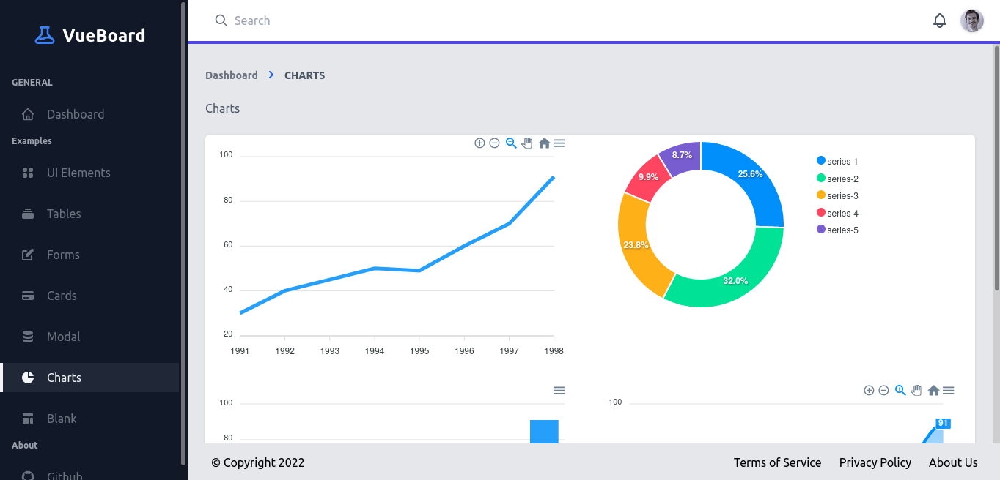
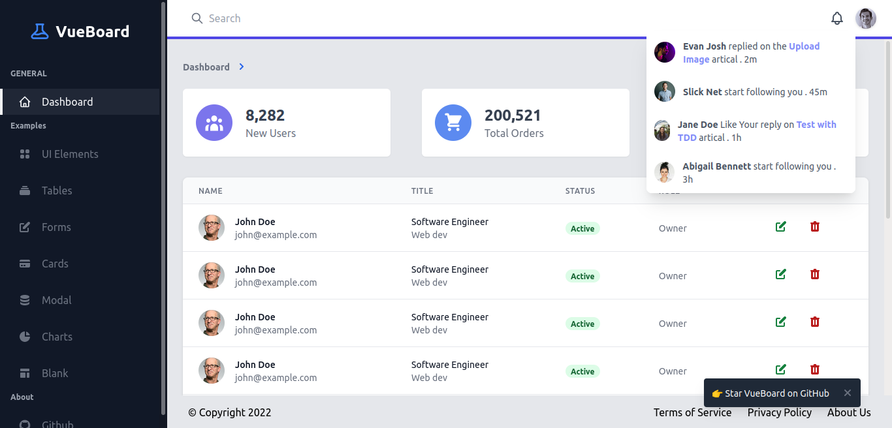

# IOM ITB Admin Dashboard

Dashboard admin untuk Ikatan Orangtua Mahasiswa (IOM) ITB yang dibangun dengan Vue 3, TypeScript, dan Tailwind CSS.




## Deskripsi

Aplikasi dashboard admin untuk mengelola berbagai aspek IOM ITB, termasuk:
- Manajemen anggota dan pendataan
- Pengelolaan donasi dan dana bantuan
- Manajemen merchandise
- Pengajuan dan pengelolaan bantuan
- Program orangtua asuh
- Kegiatan dan transaksi
- Laporan dan analitik

## Fitur Utama

- **Dashboard Analytics** - Visualisasi data dengan chart dan grafik
- **Manajemen Anggota** - Pendataan dan pengelolaan anggota IOM
- **Sistem Donasi** - Pengelolaan donasi dan dana bantuan
- **Merchandise Management** - Pengelolaan produk merchandise
- **Pengajuan Bantuan** - Sistem pengajuan dan approval bantuan
- **Program Orangtua Asuh** - Manajemen program orangtua asuh
- **Kegiatan** - Pengelolaan kegiatan dan event
- **Transaksi** - Monitoring transaksi keuangan
- **Authentication** - Sistem login dengan JWT
- **Responsive Design** - Interface yang responsif untuk berbagai device

## Teknologi yang Digunakan

- **Frontend**: Vue 3 + TypeScript
- **Styling**: Tailwind CSS
- **State Management**: Vuex 4
- **Routing**: Vue Router 4
- **Charts**: ApexCharts (vue3-apexcharts)
- **HTTP Client**: Axios
- **Authentication**: JWT (jsonwebtoken)
- **Build Tool**: Vue CLI 5

## Instalasi dan Setup

### Prerequisites

- Node.js (versi 14 atau lebih tinggi)
- npm atau yarn

### Langkah Instalasi

```bash
# Clone repository
git clone <repository-url>
cd IOM-ITB-ADMIN-main

# Install dependencies
npm install
# atau
yarn install

# Compiles and hot-reloads for development
npm run serve
# atau
yarn serve

# Compiles and minifies for production
npm run build
# atau
yarn build

# Lint and fix files
npm run lint
# atau
yarn lint
```

## Struktur Project

```
src/
├── assets/          # Static assets (images, CSS)
├── components/      # Reusable Vue components
│   ├── charts/     # Chart components
│   ├── input/      # Form input components
│   ├── modal/      # Modal components
│   └── ...
├── hooks/          # Custom Vue composition API hooks
├── partials/       # Partial components
├── router/         # Vue Router configuration
├── store/          # Vuex store modules
├── utils/          # Utility functions
├── views/          # Page components
└── main.ts         # Application entry point
```

## Halaman yang Tersedia

- **Dashboard** (`/dashboard`) - Halaman utama dengan analytics
- **Login** (`/`) - Halaman autentikasi
- **Members** (`/members`) - Manajemen anggota
- **Donasi** (`/donasi`) - Pengelolaan donasi
- **Dana Bantuan** (`/dana-bantuan`) - Manajemen dana bantuan
- **Merchandise** (`/merchandise`) - Pengelolaan merchandise
- **Kegiatan** (`/kegiatan`) - Manajemen kegiatan
- **Pengajuan Bantuan** (`/pengajuan-bantuan`) - Sistem pengajuan bantuan
- **Orangtua Asuh** (`/orangtua-asuh`) - Program orangtua asuh
- **Pendataan Anggota** (`/pendataan-anggota`) - Form pendataan anggota
- **Transaksi** (`/transactions`) - Monitoring transaksi
- **Users** (`/users`) - Manajemen pengguna
- **Charts** (`/charts`) - Visualisasi data
- **UI Elements** (`/ui-elements`) - Komponen UI

## API Integration

Aplikasi menggunakan Axios untuk komunikasi dengan backend API. Semua request API dikelola melalui service layer di `src/store/api.service.ts`.

### Authentication

Sistem menggunakan JWT (JSON Web Token) untuk autentikasi. Token disimpan dalam cookies dan divalidasi pada setiap navigasi.

## Development

### Scripts yang Tersedia

- `npm run serve` - Menjalankan development server
- `npm run build` - Build untuk production
- `npm run lint` - Linting dan fixing code

### Code Style

Project menggunakan ESLint dengan konfigurasi TypeScript dan Vue.js. Pastikan menjalankan linting sebelum commit:

```bash
npm run lint
```

## Deployment

Untuk deployment ke production:

```bash
# Build aplikasi
npm run build

# Hasil build akan tersedia di folder dist/
```

## Kontribusi

1. Fork repository
2. Buat feature branch (`git checkout -b feature/AmazingFeature`)
3. Commit changes (`git commit -m 'Add some AmazingFeature'`)
4. Push ke branch (`git push origin feature/AmazingFeature`)
5. Buat Pull Request

## Lisensi

Project ini dikembangkan untuk IOM ITB. Semua hak cipta dilindungi.

## Support

Untuk pertanyaan atau dukungan teknis, silakan hubungi tim development IOM ITB.
